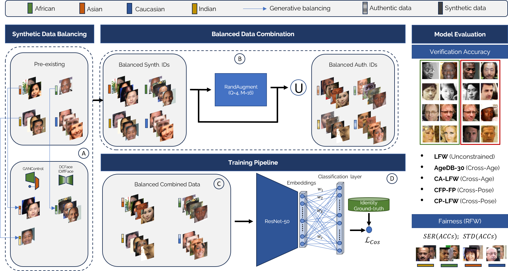

<div align="center"> Official repository of </div>

## <div align="center"> The Impact of Balancing Real and Synthetic Data on Accuracy and Fairness in Face Recognition </div>

<div align="center", padding="30px">
  <span style="display:block; height: 20em;">&emsp;</span>
  <p><b>Andrea Atzori</b><sup> 1</sup> &emsp; <b>Gianni Fenu</b><sup> 1</sup> &emsp; <b>Mirko Marras</b><sup> 1</sup></p>
  <p>Accepted at ECCV Workshops 2024</p>
  <p><a href="https://arxiv.org/pdf/2409.02867?"></a></p>
</div>

<div align="center"> and </div>

## <div align="center"> If It's Not Enough, Make It So: Reducing Authentic Data Demand in Face Recognition through Synthetic Faces </div>

<div align="center", padding="30px">
  <span style="display:block; height: 20em;">&emsp;</span>
  <p><b>Andrea Atzori</b><sup> 1</sup> &emsp; <b>Fadi Boutros</b><sup> 2</sup> &emsp; <b>Naser Damer</b><sup> 2,3</sup>&emsp; <b>Gianni Fenu</b><sup> 1</sup> &emsp; <b>Mirko Marras</b><sup> 1</sup></p>
  <p>Accepted at International Conference on Automatic Face and Gesture Recognition (FG) 2024</p>
  <p><a href="https://arxiv.org/pdf/2404.03537"></a></p>
</div>

<div align="center", padding="30px">
  <p><sup>1 </sup>University of Cagliari &emsp; <sup>2 </sup>Fraunhofer IGD &emsp; <sup>3 </sup>Technische Universität Darmstadt</p>
</div>


## <div align="center"> Overview 🔎 </div>
<div align="center">
    
</div>

## <div align="center"> Abstract 🤏 </div>

Over the recent years, the advancements in deep face recognition have fueled an increasing demand for large and diverse datasets. Nevertheless, the authentic data acquired to create those datasets is typically sourced from the web, which, in many cases, can lead to significant privacy issues due to the lack of explicit user consent. Furthermore, obtaining a demographically balanced, large dataset is even more difficult because of the natural imbalance in the distribution of images from different demographic groups. In this paper, we investigate the impact of demographically balanced authentic and synthetic data, both individually and in combination, on the accuracy and fairness of face recognition models. Initially, several generative methods were used to balance the demographic representations of the corresponding synthetic datasets. Then a state-of-the-art face encoder was trained and evaluated using (combinations of) synthetic and authentic images. Our findings emphasized two main points: (i) the increased effectiveness of training data generated by diffusion-based models in enhancing accuracy, whether used alone or combined with subsets of authentic data, and (ii) the minimal impact of incorporating balanced data from pre-trained generative methods on fairness (in nearly all tested scenarios using combined datasets, fairness scores remained either unchanged or worsened, even when compared to unbalanced authentic datasets). 
## <div align="center"> Usage 🖥 </div>

### Setup

Install all necessary packages in a Python >=3.8 environment:
```
   pip install torch torchvision numpy opencv-python mxnet easydict scipy==1.8.1 numpy==1.23.1
```

### Training

To extract scores for images in a folder,
1. configure hyperparameters and data paths in ```config/config.py``` in order to set up your environment
2. Training scripts will call `python train.py`. Make sure to set the arguments accordingly in the .sh scripts.
   See ```run.sh``` or ```run_experiments_example.sh``` as examples
    ```
    usage: train.py
    [--auth_id authentic identities]
    [--auth_ds authentic dataset]
    [--synth_id synthetic identities]
    [--synth_ds synthetic dataset]
    ```

### Evaluation
```
cd evaluation
CUDA_VISIBLE_DEVICES=0 python3 evaulation.py
```
## <div align="center"> Citation(s) ✒ </div>

If you found this work helpful for your research, please cite the article with the following bibtex entry:
```
@inproceedings{DBLP:conf/eccv/AtzoriCFM24,
  author       = {Andrea Atzori and
                  Pietro Cosseddu and
                  Gianni Fenu and
                  Mirko Marras},
  editor       = {Alessio Del Bue and
                  Cristian Canton and
                  Jordi Pont{-}Tuset and
                  Tatiana Tommasi},
  title        = {The Impact of Balancing Real and Synthetic Data on Accuracy and Fairness
                  in Face Recognition},
  booktitle    = {Computer Vision - {ECCV} 2024 Workshops - Milan, Italy, September
                  29-October 4, 2024, Proceedings, Part {XX}},
  series       = {Lecture Notes in Computer Science},
  volume       = {15642},
  pages        = {284--302},
  publisher    = {Springer},
  year         = {2024},
  doi          = {10.1007/978-3-031-91907-7\_17}
}
```

```
download as .bib file

@inproceedings{DBLP:conf/fgr/AtzoriBDFM24,
  author       = {Andrea Atzori and
                  Fadi Boutros and
                  Naser Damer and
                  Gianni Fenu and
                  Mirko Marras},
  title        = {If It's Not Enough, Make It So: Reducing Authentic Data Demand in
                  Face Recognition through Synthetic Faces},
  booktitle    = {18th {IEEE} International Conference on Automatic Face and Gesture
                  Recognition, {FG} 2024, Istanbul, Turkey, May 27-31, 2024},
  pages        = {1--10},
  publisher    = {{IEEE}},
  year         = {2024},
  doi          = {10.1109/FG59268.2024.10581990}
}
```


## License ##

This project is licensed under the terms of the Attribution-NonCommercial 4.0 International (CC BY-NC 4.0) license.

<div align="center">
    
</div>
